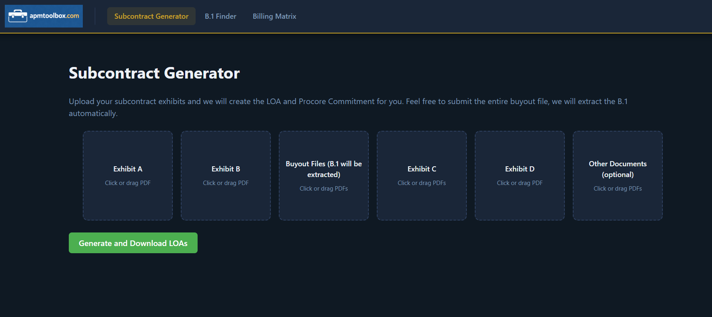
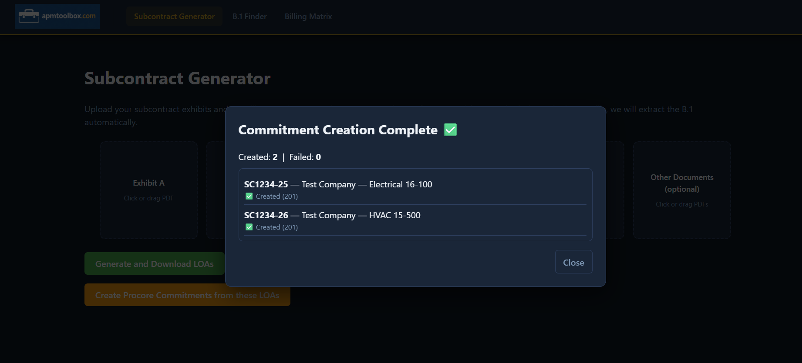
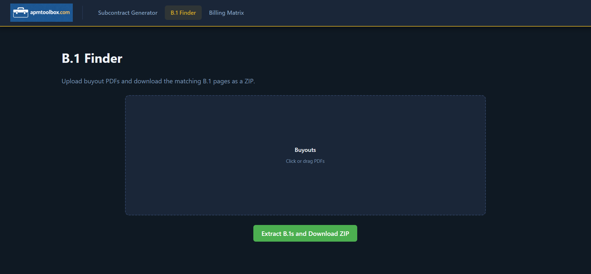
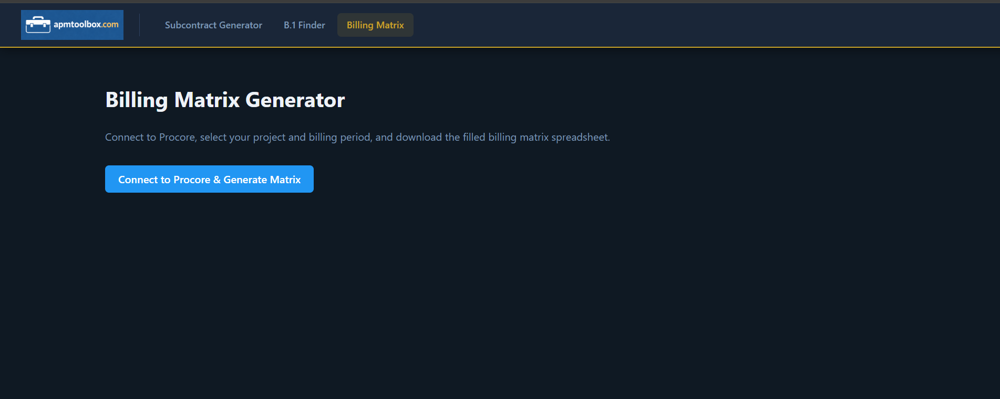

# APM Toolbox – Subcontract Generator

A React front-end for automating subcontract document generation and Procore commitment creation. Built for construction project management workflows.

### Subcontract Generator



### B.1 Finder


### Billing Matrix


---

## Features

### Subcontract Generator
Upload subcontract exhibit PDFs (A, B, B.1, C, D, and optional HASP docs) and generate a ready-to-sign LOA bundle as a ZIP download. You can submit an entire buyout file — the app will extract the B.1 automatically. After generation, optionally push the results directly to Procore as subcontract commitments with a single click.

### B.1 Finder
Upload one or more buyout PDFs and download just the extracted B.1 pages as a ZIP.

### Billing Matrix Generator
Connect to Procore, select a project and billing period, and download a pre-filled billing matrix spreadsheet (.xlsx).

---

## Tech Stack

- **React 19** with React Router v7
- **Vite** (dev server + build)
- **react-dropzone** for file upload UI
- **Procore API** (OAuth 2.0) for commitment creation and billing data

---

## Architecture

This is the front-end of a full-stack application. It communicates with a separate Python/Flask backend that handles PDF parsing, LOA generation, and Procore API integration.

> Backend repo coming soon.

---

## Getting Started

### Prerequisites
- Node.js 18+
- A running instance of the APM Toolbox backend

### Install dependencies

```bash
npm install
```

### Configure environment variables

Create a `.env` file in the project root:

```
VITE_API_BASE_URL=your_backend_url_here
VITE_API_BACKEND_KEY=your_api_key_here
```

| Variable | Description |
|---|---|
| `VITE_API_BASE_URL` | Base URL of the Flask backend (e.g. `http://localhost:5000`) |
| `VITE_API_BACKEND_KEY` | API key used to authenticate requests to the backend |

### Run locally

```bash
npm run dev
```

### Build for production

```bash
npm run build
```

---

## How It Works

1. **Upload** — User uploads subcontract exhibit PDFs via drag-and-drop or file picker
2. **Generate** — The backend parses the exhibits, fills LOA templates, and returns a ZIP of signed documents
3. **Review** — If pushing to Procore, the app fetches matching vendors and cost codes, then walks through each subcontractor for user confirmation
4. **Commit** — Confirmed subs are posted to Procore as subcontract commitments via the Procore API

---

## Author

[timahern](https://github.com/timahern)
